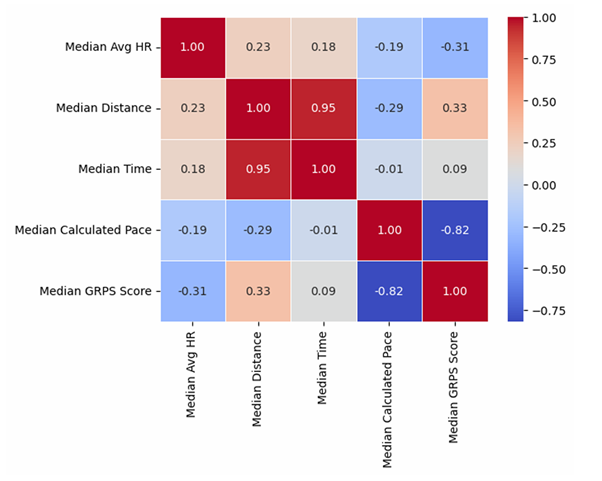
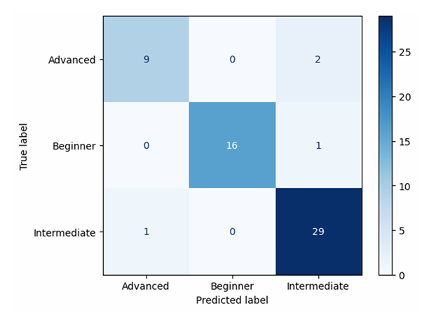
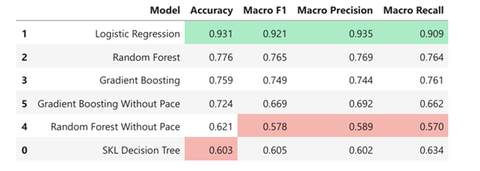

# 🏃‍♂️ Running Performance Classification & Clustering

## Overview
Classifying runners into performance tiers (Beginner, Intermediate, Advanced) is usually subjective. This project uses **Machine Learning** to objectify running performance based on biometric data (Heart Rate) and training volume, rather than just race times.

I developed a custom metric (**GRPS - General Running Performance Score**) based on the [Riegel formula]([url](https://trainasone.com/ufaq/riegels-formula/)) to label runners, and then trained models to predict these tiers.

## Objectives
* **Supervised Classification:** Predict a runner's performance tier based on their training data.
* **Unsupervised Clustering:** Use K-Means to find natural groupings in the data and compare them to the engineered labels.
* **Sensitivity Analysis:** Determine if runners can be classified accurately *without* knowing their pace (to prevent data leakage).

## Tech Stack
* **Language:** Python
* **Libraries:** Pandas, Scikit-Learn, Matplotlib, Seaborn, Plotly
* **Data:** Personal running logs (Garmin/Strava) + Kaggle Datasets (~280 unique runners)

## Methodology

### 1. Feature Engineering
* **GRPS (Target Variable):** Created a custom formula combining *Normalized Pace* and *Normalized Heart Rate* to score every run.
* **Data Cleaning:** Filtered outliers (>50km runs) and imputed missing heart rate data.

### 2. Modeling & Results
I tested multiple models to classify runners into 3 tiers.

| Model | Accuracy | Notes |
| :--- | :--- | :--- |
| **Logistic Regression** | **93%** | Best performer when Pace is included. |
| Random Forest | 77% | Robust performance even without scaling. |
| *K-Means Clustering* | *N/A* | Found 3 distinct clusters that aligned loosely with the labels (ARI Score: 0.20). |

### 3. Sensitivity Analysis (Target Leakage)
Since the target label (GRPS) is derived mainly from Pace, using Pace as a feature introduces **data leakage**.
* **Experiment:** I re-ran the models *excluding* Pace.
* **Result:** Accuracy dropped to **~75%**, which represents the "real-world" ability to classify a runner using only Heart Rate and Distance.

## Key Insights
* **Pace dominance:** As expected, pace is the strongest predictor of performance tier.
* **The "Heart Rate" Myth:** Average Heart Rate alone was a poor predictor of performance class, likely because elite runners can sustain high heart rates just as beginners can.
* **Volume Matters:** "Distance per Run" was a critical differentiator between Intermediate and Advanced runners.

## Main Plots
| Features Correlation Matrix | Confussion Matrix - Logistic Regression |
|:------------------:|:----------------:|
|  | |
| **Kmeans Vizualization** | **Model Performance Comparsion - Table** |
|  | |

## How to run
* Clone the repo - git clone [https://github.com/maorshavit-boop/Running_performance.git](https://github.com/maorshavit-boop/Running_performance.git)
* Install dependencies - pip install -r requirements.txt
* Open the notebook in Juypyetr Lab

## Project Structure
```text
├── data/               
├── plots/              
├── notebooks/          
├── requirements.txt    
├── .gitignore          
└── README.md           
